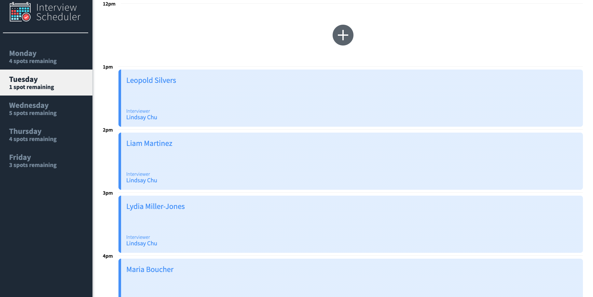
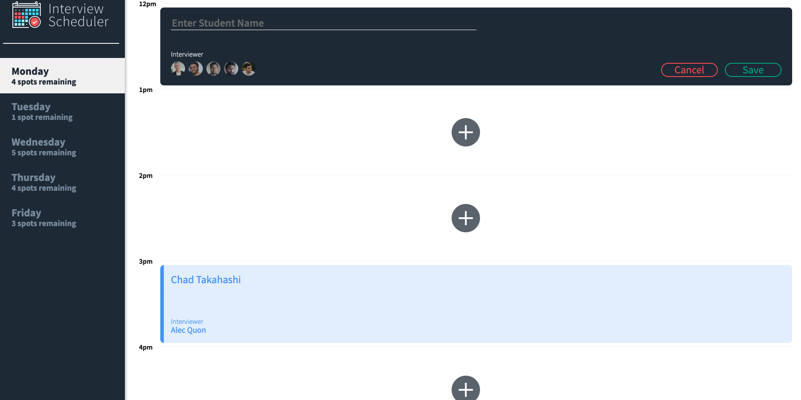
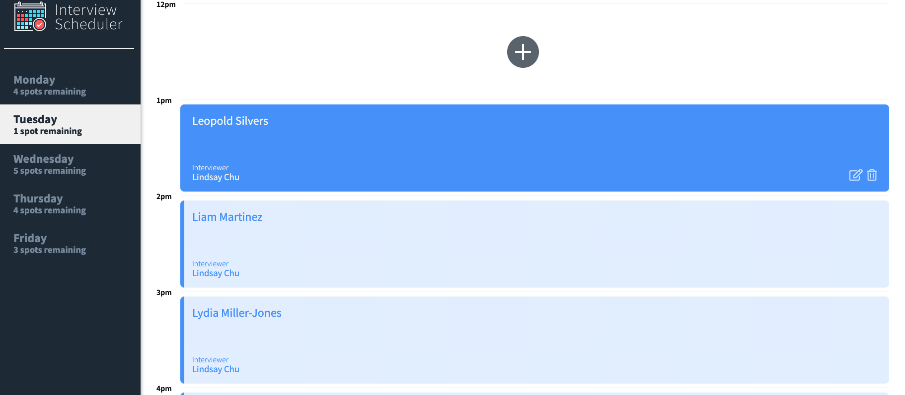
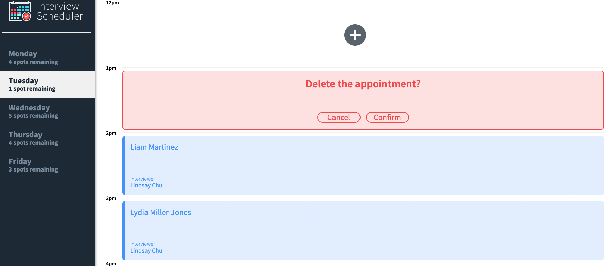

# Interview Scheduler

This project is a single page application created in REACT and component functions. A user can schedule an appointment for any available time slot with any available interviewer. The user can also edit or delete the appointment. Storybook was used to create the user inferface. All components were individually tested and were also tested end to end using JEST and CYPRESS. 

## Project Feature

- Display the weekdays
- Each day shows the number of spots available
- User can create an appointment,for available spots
- Editing the appointment
- Deleting the appointment

## Final Product






## Setup

Install dependencies with

```sh
npm install
```

## Running Webpack Development Server

```sh
npm start
```

## Running Jest Test Framework

```sh
npm test
```

## Running cypress Test Framework

```sh
npm run cypress
```

## Running Storybook Visual Testbed

```sh
npm run storybook
```

## Dependencies
- React
- Axios
- Sass
- Node.js
- PostgreSql
- Storybook
- Webpack Server
- Jest
- Cypress